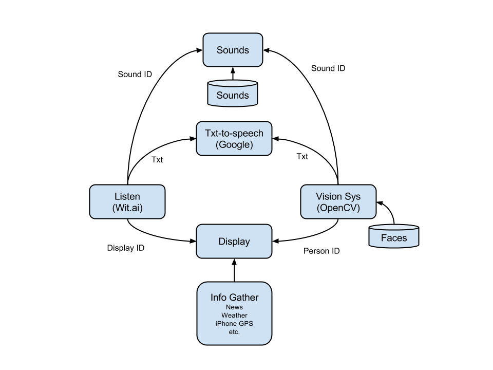

# Jarvis

A simple Jarvis written in Python. Still lots of work to do

# Nodes

Jarvis is comprised of a series of nodes as shown below.

## Vision

## Sounds

In: wave file id

Plays a wave file.

## Text to Speech

In: Text string

Converts a string to a wave file using Google Speech.

## Sound Server

Jarvis uses [wit.ai](https://wit.ai) to understand the spoken word, turning speech in to text (stt). There are a bunch of plugins which act upon the text to perform different things:

 * Say current time
 * Say current date
 * Send a text message using [Twilio](https://www.twilio.com)
 * Tell a joke (most of the jokes are not funny)
 * Say a greeting
 * Tell you to stop being mean or cursing
 * Play random sound bites from movies and tv shows:
 	* Venture Brothers
 	* Blues Brothers
 	* Star Wars
 * Tell current or future weather forecast using [Forcast.io](http://forecast.io)
 * Grab news headlines
 * General help info
 
Additionally, the text-to-speech part uses [Google Translate](https://translate.google.com) (which sounds the best) or uses `say`.

## Plugins

All plugins are based off this Module class, which basically setups up logging and has methods for reading Yaml files and determining if this plugin handles the requested intent.

	class Module:
		"""
		Sets up the logger and stores the intent of the module.
		"""
		def __init__(self,mod_name='none'):
			logging.basicConfig(level=logging.INFO)
			self.logger = logging.getLogger('robot')
			self.intent = mod_name
			self.logger.info('[+] Init module %s'%(self.intent))
		
			# get parameters
			if not hasattr(self,'info'):
				file = '/Users/kevin/Dropbox/accounts.yaml'
				self.info = self.readYaml(file)
				#self.logger.info('[+] Loaded: %s'%(file))
	
		def readYaml(self,fname):
			"""
			Read a yaml file and return the corresponding dictionary
			in: file name
			out: dict
			"""
			f = open( fname )
			dict = yaml.safe_load(f)
			f.close()
		
			return dict
	
		def handleIntent(self,intent):
			"""
			Returns True if the intent passed matches the intent of this module.
			"""
			ans = False
			if self.intent == intent:
				ans = True
			return ans

An example plugin, which uses the base class Module, is shown below for reading back the current time.

	class Plugin(Module):
		def __init__(self):
			Module.__init__(self,'time')
			self.intent = 'time'
		
		def process(self, entity):
			"""
			Grabs the local time
			"""	
			t = time.localtime()
			hrs = t[3]
			if hrs > 12:
				hrs = hrs - 12
				ampm = 'pm'
			else:
				ampm = 'am'
			mins = t[4]
			resp = 'The current time is %d %d %s'%(hrs,mins,ampm)
			return resp

# To Do's

* [ ] Turn off/on listening for audio instead of just doing it all the time until it crashes
* [ ] Need better solution for exit, not sure what to do
* [x] Pass location of Yaml file with API accounts
* [ ] Reload plugins
* [ ] General command line args
* [ ] Example init.d script
* [ ] Allow external commands from a camera system, to trigger plugins via zmq
* [ ] Might break up tv/movie sounds into individual plugins
* [ ] Change plugins from list to dict, simplify things better
* [ ] Create other processes: Display, sound
* [ ] Ask jarvis for help on how to do things

## Libraries Used

You need the following key python libraries installed:

* python-forecastio - weather
* wit - speech-to-text
* twilio - SMS
* PyYAML - read yaml config files
* zmq - network connections to other nodes
